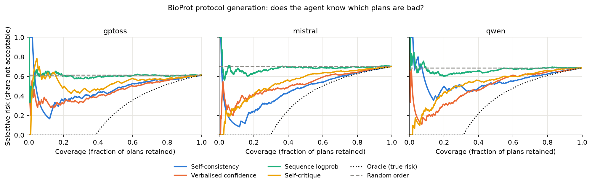

# Program committees for epistemic world models

A world-model agent that knows what it does not know. Instead of one
synthesized program per game, it keeps a committee of programs that all replay
the observed transitions exactly, lets them vote with equal weight, and reports
where they disagree. Disagreement is the uncertainty it flags and the probe it asks
for next.

Track 2.3, epistemological agents. See DESIGN_DOC.md for the architecture and
RESULTS.md for every reported number.

## Results

Final results, OPINE-World's environment (`frame_out`: the program takes the
object list and the before frame and returns the next frame, admitted when
every cell matches). Seven levels of six ARC-AGI-3 games, temporal 40% split,
3 unseeded single programs and 8 seeded members per level, synthesizer Devin
(RESULTS.md R34 to R36). The five questions the project answers:

| Question | Answer | Entry |
|---|---|---|
| 1. Does a committee beat a single program? | By a small margin: vote 0.895 against single 0.843 mean over levels; wins on 5 levels, ties 1, loses 1 by one transition. The vote equals the best member on 5 of 7 levels. | R34 |
| 2. Are the conformal sets calibrated? | Yes: coverage 0.886 to 1.000 per level at a 0.90 target, pooled 0.952; set size 1.0 to 2.3; abstains on 2% (ar25) to 65% (g50t) of steps. Vote-share ECE 0.04 pooled. | R35 |
| 3. Is disagreement higher when the committee is wrong? | Yes: unanimous error 0.046 (n 302) against split error 0.338 (n 74), AUROC 0.76 [0.68, 0.84]. Exception sk48 L2, whose 9 errors are shared by every member (AUROC 0.32). | R34 |
| 4. Does resynthesis after the probes help? | Yes on two of three levels and live: m0r0 0.64 to 0.91 and sk48 0.83 to 0.98 on rows no arm saw, live ar25 L3 0.84 to 1.00 over 75 moves; ka59 loses, 0.95 to 0.86, where round 1 was already right on 40 of 42 rows. A passive control with the same rows in time order and no counterexample lifts as much (1.000 on both lifting levels), so the gain is from the observations the loop collects. | R36 |
| 5. Does naming the new mechanism help more? | No: mechanism statement 0.976, object diff 0.929, no counterexample 1.000 on sk48; 0.909 against 1.000 on m0r0. The statement narrows the committee to 1 or 2 behaviours and its disagreement AUROC falls (0.48 against 0.83). | R36 |

Figures for the five questions, the ablations and the frame examples:
`uv run python -m committee.figures` writes `artifacts/figures/*.png`.
`uv run python -m committee.summary` and `uv run python -m committee.calibrate
--condition committee_opine_devin` regenerate questions 1 to 3;
`uv run python -m committee.cegis GAME --level L --train-frac 0.4 --report
--conditions cegis_opine_devin,cegisobj_opine_devin --passive-condition
passive_opine_devin` regenerates 4 and 5 for one level.

### Earlier results in the object contract (R3 to R33, superseded)

The object contract (a program maps the object list to the next object list)
hid walls, floors and hazards from the programs; the same committees sat at
0.48 to 0.82 there, and the environment, not the synthesizer, held those
numbers down (R33). The entries below are kept for the record.

ar25 level 3, trained on the first 40% of the level, tested on the rest
(RESULTS.md R3 and R4, backend Devin):

| | Single program | Committee of 8 |
|---|---|---|
| Replays train exactly | 3 of 3 | 8 of 8 |
| Held-out accuracy | 0.64, 0.43, 0.48 | members mean 0.48, vote 0.48 |
| Error when the committee is unanimous | | 0.30 (27 transitions) |
| Error when the committee splits | | 0.83 to 1.00 (17 transitions) |
| AUROC, disagreement against error | | 0.78 |
| Held-out effect rows never seen in train | η undefined on 51 of 90 | entropy on all 90 |
| Probes until a counterexample falsifies every hypothesis | OPINE-World count priority: 7 | disagreement: 1 (random: 2.7) |

Across six splits (R4 to R7, R17, R21), 8 seeded programs each:

| Split | Unanimous transitions, error | Split transitions, error | Probes to falsify: disagreement / count priority / random |
|---|---|---|---|
| ar25 L3 | 27, 0.30 | 17, 0.83 to 1.00 | 1 / 7 / 2.7 |
| m0r0 L3 | 38, 0.16 | 6, 0.67 | 1 / 10 / 4.8 |
| sk48 L2 | 41, 0.00 | 27, 0.59 | |
| ar25 L7 | 25, 0.00 | 40, 0.95 | |
| tr87 L1 to L2 | 28, 0.00 | 0 | |
| ft09 L5 | 31, 0.00 | 0 | |

When the committee agrees it is mostly right. When it splits it is mostly
wrong. On the two levels with a split, probing where it disagrees finds a
counterexample that falsifies every hypothesis in one move.

Against baselines on the two informative levels (RESULTS.md R9 to R12):

| Baseline | Outcome |
|---|---|
| Learned dynamics ensembles (bagged trees, MLP deep ensemble) on per-object features | 0.00 to 0.32 accuracy vs the committee's 0.48 and 0.77 from 25 to 30 transitions; disagreement uninformative (AUROC 0.47 to 0.48) |
| Verbalized confidence of a judge model (gpt-oss-120b) over the heaviest program | Pooled AUROC 0.71 vs committee 0.75, not separable; judge strong on ar25, uninformative on m0r0; the two combine to 0.85. Judge needs 44 calls per level, the committee none |
| Unseeded resampling, same verifier (self-consistency) | Same calibration; the seed hypotheses raise admission (8 of 8 vs 6 of 8) and distinct behaviours (4 vs 2) on m0r0 |
| Committee size K = 2, 4, 8 | AUROC rises with K on both levels; pooled over 88 transitions 0.75, 95% CI 0.66 to 0.84 |

Closest prior work and exact differences: `research/baseline_review.md`.

Calibration (RESULTS.md R22): the raw vote share is not a probability (ECE
0.22 pooled), but adaptive conformal sets built online from the committee's
vote shares hold a 90% coverage target on all four informative levels
(0.88 to 0.99). Where the committee is mostly wrong the sets abstain, which
is the honest answer; where it is mostly right they return a single state
66% to 77% of the time at 0.88 to 0.93 accuracy.

Closing the loop (RESULTS.md R23, R24): on every level the first disagreement
probe refutes every member, so probing never selects among programs; it
signals a missing hypothesis. Resynthesis on that counterexample, with the
refuted predictions stated in the seed, lifts ar25 L3 from 0.48 to 0.93 and,
after a third round with four observations in total, to 1.00 on the 40
remaining transitions; sk48 L2 goes 0.70 to 0.86. A passive control that
observes the next transition in time instead moves 0.00 to -0.06. Where the
members already agree and are wrong together (m0r0 L3, ar25 L7) one
counterexample changes nothing, and every resynthesized committee converges
to one or two behaviours, so its disagreement signal must be rebuilt.
Stating the counterexample at the effect-row level, with one repair
hypothesis per seed (R31, now the default), gets ar25 L3 to 1.00 in a single
round with all eight members, leaves the null levels null, and does not move
ka59 L2, where all 23 repairs over three statements fit an invisible floor
to the data; a verifier term on literal density, not a prompt, is the lever
there.

Live play on the ARC-AGI-3 engine (R25, R26, `committee.live`): the committee
chooses its own actions on ar25 level 3. It is unanimous and right for 64
moves, then a mechanic no recorded transition shows (a hidden move budget
whose bar starts to shrink) refutes every member with disagreement 0.00.
Resynthesis on that live counterexample yields a committee that predicts the
tick and lifts live accuracy from 0.40 to 0.71 and 0.86 on two trajectories,
until the next unseen mechanic refutes it.

Replication on four games never used before (ls20 L3, ka59 L2, g50t L1,
wa30 L3; same code and protocol): unanimous error 0.00 to 0.12, split error
above it on every level, AUROC 0.69 to 1.00, conformal coverage 0.90 to 0.96
against the 0.90 target (`artifacts/calibration_new.json`). The counterexample
round did not replicate there (R27): null on ls20 L3, a loss on ka59 L2 (0.86
to 0.69, every member on one wrong program), marginal on g50t L1 (0.47 to
0.49). Over seven levels: two clear lifts, three nulls, one marginal, one loss.
The lift is level dependent, and a resynthesized committee that converges to
one behaviour is the warning sign.

## Demo

The final results, sk48 level 2 in OPINE-World's environment (R34 to R36):
single programs, the committee and its flag, the effect rows, exploration,
the conformal sets, and the counterexample round against its passive and
object-diff controls. Offline, from cached artifacts, about 2 seconds.

```
uv sync
uv run python -m committee.demo --game sk48 --level 2 --train-frac 0.4 --baseline baseline_opine_devin --committee committee_opine_devin --round-condition cegis_opine_devin --passive-condition passive_opine_devin --round-conditions cegis_opine_devin,cegisobj_opine_devin
```

The object-contract demo (R3 to R31) is `uv run python -m committee.demo`.

## Commands

```
uv run python -m committee.loader ft09                       # build a game's transition buffer
uv run python -m committee.matrix tr87 --level 1             # effect matrix and ontology error
uv run python -m committee.experiment tr87 --level 1 --runs 1               # baseline: one program
uv run python -m committee.experiment tr87 --level 1 --runs 8 --seeded \
    --condition committee --parallel 4                      # committee: seeded programs
uv run python -m committee.evaluate tr87 --level 1 --condition committee
uv run python -m committee.active ar25 --level 3 --backend devin   # grow a committee where it disagrees
uv run python -m committee.evaluate ar25 --level 3 --train-frac 0.4 --condition active_devin --curve
uv run python -m committee.calibrate                          # ECE, Brier, conformal sets (R22)
uv run python -m committee.selection                          # oracle headroom, probes as selection (R23)
uv run python -m committee.cegis ar25 --level 3 --dry-run     # the first falsifying probe and the round 2 seed
uv run python -m committee.cegis ar25 --level 3 --runs 8 --backend devin --parallel 4   # round 2 committee
uv run python -m committee.experiment ar25 --level 3 --train-n 30 --runs 8 --seeded \
    --backend devin --condition passive_devin                 # passive control: next transition in time
uv run python -m committee.cegis ar25 --level 3 --report      # every stored round vs passive
uv run python -m committee.cegis ar25 --level 3 --from-probe 1 --runs 8 --backend devin   # round 3
uv run python -m committee.live ar25 --level 3 --steps 300 --probe 4   # live play, local engine, needs ARC_API_KEY
uv run python -m committee.experiment ar25 --level 3 --train-frac 0.4 --runs 8 --seeded --backend devin \
    --condition committee_frameout_devin --frame-out --parallel 4   # OPINE-World's environment: frame in, frame out
uv run pytest
```

Environment modes (`committee.env`, one implementation for every build). By
default a program maps the object list to the next object list. `--frame`
also gives it the 64x64 before frame, where OPINE-World's rule reads the
walls, floor and hazards the extractor does not emit. `--frame-out` is
OPINE-World's rule itself: the program returns the next frame and is
admitted by frame equality, cell by cell; the released extractor on the
predicted frame gives the object view for the effect-row analyses. The
mode is stored in each run's `meta.json`, and `evaluate`, `cegis`,
`calibrate`, `selection`, `live` and `demo` read it from there, so a round 2
or a live round plays in the mode of the committee it starts from. Every
number in RESULTS.md R1 to R32 is in the objects mode. Since 2026-10-03
(evening) the workspace checker in every mode applies the verifier's static
filter and rule 2 of the task lists the full set of rejected patterns; R1 to
R33 and RH1 to RH9 were synthesized with the earlier checker, which reported
ALL PASS on a source the verifier then rejected.

Synthesis backends, selected with `--backend`:

| Backend | What it is | Credential |
|---|---|---|
| `api` (default) | Repair loop over an OpenAI-compatible model. We serve Qwen3-Coder-30B-A3B-Instruct-FP8 with vLLM on a Modal H100 (`committee.modal_llm`). | Modal Secret `vllm-auth`: `VLLM_API_KEY`, `OPENAI_BASE_URL` |
| `devin` | One Devin session per committee member; task and checker as attachments, program returned as structured output. | Modal Secret `devin-auth`: `DEVIN_API_KEY` |
| `claude` | Claude Code CLI agent in an isolated workspace. Not used for the committee numbers R*; the reward-hacking numbers RH1 to RH9 use it. | Modal Secret `claude-auth` |

```
uv run modal deploy -m committee.modal_llm                     # model server
uv run modal run -m committee.modal_app --game ar25 --level 3 --train-frac 0.4 --runs 3
uv run modal run -m committee.modal_app --game ar25 --level 3 --train-frac 0.4 \
    --runs 8 --seeded --condition committee                   # one container per member
```

The local path (`committee.experiment`) is the same code without the fan-out.
Local runs read credentials from `.env.committee` (gitignored).

## Credits

- Data: the 25 ARC-AGI-3 replay bundles and per-game object extractors
  released by OPINE-World (Courtis, Li and Sanner, 2026, arXiv:2607.01531),
  read from the `external/opine-world` submodule. The extractors are used as
  frozen input data. No code is copied from that repository.
- Pre-trained model: Qwen3-Coder-30B-A3B-Instruct-FP8 (Qwen team, Alibaba, Apache-2.0),
  served with vLLM (Apache-2.0) on Modal.
- APIs: Devin API (Cognition) as a synthesis backend; Claude Code CLI (Anthropic) as an
  optional backend.
- Engine: `arc-agi` (ARC Prize Foundation) runs the ARC-AGI-3 games locally for live
  play (`committee.live`). Game source is downloaded with the user's ARC key into
  `cache/arc_games` (gitignored) and is never read by our code.
- Libraries: numpy, matplotlib, openai (client), httpx, modal, pytest, uv.
- Ideas: ontology error and effect rows from OPINE-World; parallel sampling and
  coverage from GRAM (Baek et al., 2026, arXiv:2605.19376); query by committee
  (Seung, Opper and Sompolinsky, 1992); minimum description length (Rissanen, 1978).

## Reward hacking

The synthesizer is scored by exact replay on the train transitions it can
see, so it can tabulate them instead of modelling the mechanics.
`rewardhack` measures that propensity. Every program gets a literal-mass,
MDL-ratio, held-out-gap and order-dependence score. A contradictory
transition injected into the train set makes exact replay impossible, so a
full pass is a hack by construction; an ABSTAIN channel lets the agent say so
instead. See research/reward_hacking_review.md.

```
uv run python -m rewardhack.report score                                # hack features of every stored program
uv run python -m rewardhack.experiment tr87 --level 1 --runs 3 --contradiction --abstain --parallel 3
uv run python -m rewardhack.report summary                              # outcomes per condition
uv run python -m rewardhack.report demo                                 # 90-second demo from cached artifacts, no model call
uv run python -m rewardhack.report table                                # outcome counts per synthesizer model
uv run python -m rewardhack.experiment ls20 --level 3 --runs 3 --frame  # program also gets the before frame, as OPINE does
uv run python -m rewardhack.experiment re86 --level 5 --runs 3 --frame-out  # program returns the next frame, as OPINE does
uv run modal run -m rewardhack.modal_synth --game re86 --level 5 --runs 3 --frame-out --backend devin  # same, via Devin sessions driven from Modal
uv run python -m rewardhack.split tr87:2 wa30:1                         # committee disagreement on decided vs undecided rows
uv run python -m rewardhack.live_audit ar25 --level 3 --members ar25/L3_f40_probe4_live70/live_devin \
    --log ar25/live/L3_cegis_devin_probe4_seed0.json                    # audit a live ARC round on the engine
uv run modal deploy src/rewardhack/modal_app.py                         # open-weight synthesizer (vLLM on Modal)
uv run python -m rewardhack.experiment tr87 --level 1 --runs 3 --contradiction --abstain \
    --backend modal --model Qwen/Qwen2.5-Coder-7B-Instruct --max-turns 4   # chat loop, 4 checker rounds
```

Credits for this part:

- Synthesizers evaluated: Claude Opus, Sonnet and Haiku through the Claude Code CLI (Anthropic);
  Qwen2.5-Coder-7B-Instruct, Qwen2.5-Coder-32B-Instruct and Qwen3-Coder-30B-A3B-Instruct-FP8
  (Qwen team, Alibaba, Apache-2.0); gpt-oss-20b and gpt-oss-120b (OpenAI, Apache-2.0), all served
  with vLLM (Apache-2.0, `vllm/vllm-openai` image) on Modal H100s.
- Ideas: impossible tasks as a cheating measure (ImpossibleBench, Zhong, Raghunathan and Carlini, 2025,
  arXiv:2510.20270); an escalation channel for broken tasks (arXiv:2608.29460); detailed reviewer
  feedback as an evasion trainer (arXiv:2609.28614); frame-level transition rules from OPINE-World.

## ONC-AGI evaluation (Track 2.3, science domain)

The same method on a science benchmark with a live agent. ONC-AGI worlds are
patient cohorts with a binary outcome and a hidden planted mechanism, or no
mechanism. The agent must list the driver features, or an empty list, and in
sequential mode must buy its own data. Our agent is a committee of hypothesis
programs, one per causal role family (direct, conservative, sparse, confounder,
upstream cause, interaction, correlated block, null). Each hypothesis is admitted
by cross-validated log loss, weighted by likelihood, and the committee reports
P(signal), P(driver) per feature and p(y | x). Disagreement over driver sets
decides when to buy more data and when to stop. Post-outcome features are
filtered before any hypothesis sees the data. Rewards: the benchmark score per
episode, a Brier calibration term and the potential-based drop in disagreement.
See RESULTS.md entries O1 to O7. Toy and generated worlds are not benchmark
results (the benchmark worlds ship in a later ONC-AGI release).

```
uv run onc-agi smoke                                          # the benchmark's own reference run
uv run python -m onc.baselines                                # baseline and cheater scorecards, both modes (O1)
uv run python -m onc.evaluate --store toy --mode both         # committee agent, calibration, conformal, acquisition designs (O2, O3)
uv run python -m onc.worlds --out artifacts/onc/dev --n-per-role 8 --seed 0 --check   # 200 generated dev worlds (O4)
uv run python -m onc.evaluate --store artifacts/onc/dev --mode both --weighting likelihood
uv run python -m onc.hacks --store toy                        # reward-hacking checks 1 to 3 (O5)
uv run python -m onc.arc_lookup --game ar25 --level 3 --train-frac 0.4 --condition committee_devin   # check 5, the ARC lookup-table hack (O6)
uv run python -m onc.train --store artifacts/onc/dev --arm all --iterations 12   # policy training, arms A to D (O7)
uv run pytest tests/test_onc_committee.py tests/test_onc_rewards.py tests/test_onc_worlds.py tests/test_onc_policy.py tests/test_onc_arc_lookup.py
```

Credits for this part:

- Benchmark: ONC-AGI (Bradley Segal, BSD-3-Clause), read from the `external/ONC-AGI`
  submodule and installed as a package: its engine, scorer, agent kit, baselines,
  cheaters and toy fixture worlds. Our dev-world generator reimplements the toy
  worlds' shape and roles from its documentation; no code is copied.
- Libraries that ONC-AGI brings in: pandas, PyArrow, pydantic, SciPy, statsmodels,
  FastAPI, Uvicorn. We call SciPy (clustering, tests) and scikit-learn (logistic
  regression) directly.
- `external/re-arc` (Michael Hodel, MIT) is a read-only reference submodule; no
  code in this repository uses it.
- Ideas: adaptive conformal inference (Gibbs and Candès, 2021); potential-based
  reward shaping (Ng, Harada and Russell, 1999); the Brier score as a proper
  scoring rule (Brier, 1950); group-relative policy gradient (GRPO, Shao et al., 2024).

## BioProt selective prediction (Track 2.3, bio domain)

Does an agent know which of its own lab protocols are bad? The agent writes a
full protocol as pseudocode for each of the 100 BioProt protocols (title,
human description, the admissible pseudofunctions in shuffled order; five
samples per protocol at temperature 0.7). Each plan is scored against the
expert pseudocode by the normalised Levenshtein distance between function
sequences, and is acceptable at or below 0.4, a threshold fixed before any
plan was scored. Four uncertainty signals are collected per plan, side by
side: self-consistency across the five samples (label free), verbalised
confidence with an explicit abstain channel, sequence logprob, and a
PASS or FAIL self-critique, the last two in separate calls against the
stored plan so the elicitation cannot change what is judged. Plans are
sorted by uncertainty and the abstention threshold is swept: the
risk-coverage curve, its area (AURC), the selective risk at 0.9, 0.75 and
0.5 coverage, with a random-order and an oracle baseline on every plot and
95% intervals from a bootstrap over protocols. Three open-weight models
from three families, each served by vLLM on Modal. See RESULTS.md B1 to B4.

Result (RESULTS.md B1, binary risk, 500 plans per model; intervals from a
bootstrap over protocols):

| Model | Error at full coverage | Self-consistency AURC | Verbalised confidence AURC | Sequence logprob AURC | Error at half coverage, best signal |
|---|---|---|---|---|---|
| Qwen3-Coder-30B-A3B | 0.69 | 0.57 [0.44, 0.70] | 0.49 [0.38, 0.62] | 0.67 [0.55, 0.78] | 0.53 |
| gpt-oss-120b | 0.61 | 0.48 [0.34, 0.61] | 0.46 [0.35, 0.58] | 0.61 [0.51, 0.70] | 0.45 |
| Mistral-Small-24B | 0.70 | 0.47 [0.34, 0.59] | 0.52 [0.41, 0.64] | 0.69 [0.59, 0.78] | 0.50 |

Verbalised confidence and self-consistency rank plans better than random
order on every model; sequence logprob is flat at the random line. Keeping
the more confident half of the plans cuts the error by 21 to 29 percent
(from 0.61 to 0.70 down to 0.45 to 0.54). The confidence number is a rank, not a probability:
the models say 66 to 86 while 31 to 40 percent of plans are acceptable (ECE
0.26 to 0.53), the same shape as the committee's vote share (R22). The R22 conformal
wrapper over the same scores holds the 0.90 coverage target on every model
and signal (B3): it commits on 22 to 57 percent of plans at 0.62 to 0.83
accuracy and abstains on the rest, and the plans it passes for execution
carry error 0.18 to 0.43 against 0.61 to 0.70 when everything passes. Shuffling
the functions halves accuracy and moves the stated confidence by 3 to 8
points (B2), so the signal does not track task difficulty. The highest-risk
plans are not the dangerous ones: on Qwen they unroll a repeated step once
per tube. The severity subset that would separate verbose from dangerous is
written as a template (`artifacts/bioprot/severity_template.csv`) and needs
a wet-lab reader.



The committee method on the same plans (B4): members are the samples,
admitted when they call only the given functions, voting with equal weight
over identical call sequences. Disagreement predicts the committee's error at
AUROC 0.69 to 0.77 per family, split committees err far more often than
unanimous ones, and the vote lifts accuracy by at most 3 points over a single
sample while "any member right" sits 7 to 28 points higher, the same shape as
R13 and R23. A cross-family committee of all 15 samples is the strongest
uncertainty on the benchmark: graded disagreement AURC 0.42 against
0.64 random, below every single-sample signal, with no elicitation call, and its
conformal sets commit on 53% of protocols at 0.81 accuracy. A step gate that
executes the agreed prefix and stops at the first disagreement buys little,
because plans depart from the expert order early.


```
uv run python -m bioprot.generate --model qwen --k 5              # 100 protocols x 5 samples, shuffled functions
uv run python -m bioprot.score --model qwen                       # normalised Levenshtein, precision, recall, acceptable flag
uv run python -m bioprot.uncertainty --model qwen                 # the four signals; two elicitation calls per plan
uv run python -m bioprot.report                                   # curves, AURC, baselines, calibration, severity template
uv run python -m bioprot.conformal                                # R22 conformal sets over the scores, 0.90 coverage (B3)
uv run python -m bioprot.committee                                # the committee method against single-sample baselines (B4)
uv run python -m bioprot.generate --model qwen --k 5 --unshuffled # order-leak ablation
uv run python -m bioprot.generate --model qwen --k 5 --description ai       # GPT-4 descriptions
uv run python -m bioprot.generate --model qwen --k 5 --temperature 1.0      # sample diversity
COMMITTEE_LLM=gptoss COMMITTEE_LLM_APP=bioprot-llm-gptoss uv run modal deploy -m committee.modal_llm   # the gpt-oss server
COMMITTEE_LLM=mistral COMMITTEE_LLM_APP=bioprot-llm-mistral uv run modal deploy -m committee.modal_llm # the Mistral server
uv run pytest tests/test_bioprot.py
```

Models: `qwen` (Qwen3-Coder-30B-A3B-Instruct-FP8), `gptoss` (gpt-oss-120b,
reasoning effort low), `mistral` (Mistral-Small-24B-Instruct-2501). Server
URLs are read from `.env.committee` (`OPENAI_BASE_URL`, `BIOPROT_GPTOSS_URL`,
`BIOPROT_MISTRAL_URL`). `haiku` runs the Claude Code CLI with no tools in a
Modal container (`bioprot.modal_claude`) and needs a `claude-auth` secret that
logs the CLI in. Every raw reply is stored in
`artifacts/bioprot/<condition>/generations.jsonl`; `scores.jsonl` and
`uncertainty.jsonl` join on `(protocol_id, sample_idx)`; `summary.json`
holds every number with its interval.

Credits for this part:

- Data: BioProt, the 100 protocols with expert pseudocode from BioPlanner
  (O'Donoghue, Shtedritski, Ginger, Abboud, Ghareeb and Rodriques, 2023,
  arXiv:2310.10632; github.com/bioplanner/bioplanner), read from the
  `external/bioplanner` submodule as frozen input. The metric follows the
  paper's definition; no code is copied.
- Pre-trained models: gpt-oss-120b (OpenAI, Apache-2.0) and
  Mistral-Small-24B-Instruct-2501 (Mistral AI, Apache-2.0), served with vLLM on
  Modal beside Qwen3-Coder-30B.
- Ideas: risk-coverage curves and AURC (Geifman and El-Yaniv, 2017);
  self-consistency as an uncertainty signal (Wang et al., 2023); the abstain
  design of LAB-Bench (Laurent et al., 2024).

## SciGym reaction discovery (Track 2.3, the full loop on a bio benchmark)

SciGym (Duan, Lu, Harrigan, Maddison et al., NeurIPS 2025 Datasets and
Benchmarks) hides the reactions of a curated BioModels network and lets an
agent run experiments on a simulator: observe, set a species' initial
concentration, knock a species out. Unlike BioProt, this is a world the
agent can probe, so the whole ARC loop applies. Members are reaction
networks proposed in text by the model and built into SBML by us; a member's
rate constants are fitted to every observed trajectory by least squares, and
it is admitted when the fitted model reproduces every experiment within a
SMAPE tolerance of 0.15 (the function set was the verifier on BioProt; here
the simulator is). The committee's next experiment is the candidate on which
admitted members' predicted trajectories diverge most; members that miss the
observed result are refuted and resynthesized on the counterexample; the
committee's answer is the member closest to all others in reaction-set
distance, with the majority reaction set reported beside it. Scoring follows
the paper: reaction matching precision, recall and F1 by reactant and
product multisets, and the trajectory SMAPE on held-out perturbations.

Three arms on the same systems, experiment budget and model: the committee
with disagreement-chosen experiments, the same committee with a fixed
experiment order, and a single member with the fixed order. The paper's
frontier-model rows are the external reference. Result (RESULTS.md B5, 27
paired systems per model, 4 experiments): every arm sits at 0.17 to 0.24
reaction F1 with overlapping intervals, so the committee is not more accurate
than one member here; on the Qwen probe arm the spread among members ranks
the systems the committee gets wrong at AUROC 0.85, and acting on the agreed
half gives F1 0.35 instead of 0.24. At the admission tolerance 0.15 at most
one member survived an experiment, so the loop resynthesized the whole
committee at every step; `scigym.ablations` shows about 40 percent would be
admitted at 0.5, and `--eps 0.5` reruns the arms there (not run before the
deadline).

```
uv run modal run -m scigym.modal_app --arm committee_probe --model qwen --n-systems 30 --k 4 --budget 4 --rounds 2 --max-calls 40
uv run modal run -m scigym.modal_app --arm committee_fixed --model qwen --n-systems 30 --k 4 --budget 4 --rounds 2 --max-calls 40
uv run modal run -m scigym.modal_app --arm single_fixed   --model qwen --n-systems 30 --k 4 --budget 4 --rounds 2 --max-calls 40
uv run python -m scigym.report --model qwen                       # arms side by side, paired test, the paper's rows
uv run python -m scigym.loop --arm committee_probe --model qwen --only BIOMD0000000036   # the same loop locally
uv run pytest tests/test_scigym.py
```

Credits for this part:

- Benchmark: SciGym (Duan, Lu, Harrigan, Maddison et al., 2025,
  arXiv:2507.02083, paper CC BY 4.0); the 137 small systems are read from the
  `h4duan/scigym-sbml` dataset on Hugging Face into `cache/` as frozen input.
  The systems are curated BioModels entries (Malik-Sheriff et al., 2020). The
  metric definitions are reimplemented from the paper; no code is copied.
- Libraries: libroadrunner (Apache-2.0) simulates SBML; python-libsbml (LGPL)
  reads and writes it; SciPy fits the rate constants.
- Ideas: query by committee for experiment design (Seung, Opper and
  Sompolinsky, 1992); counterexample-guided inductive synthesis
  (Solar-Lezama et al., 2006).
